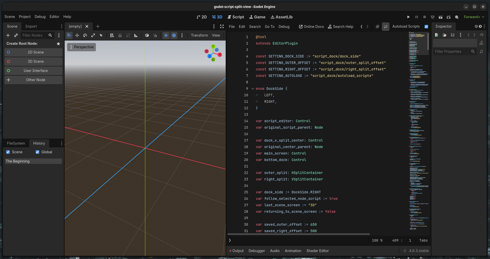

# ScriptDock

A Godot editor plugin that keeps your code and your game side-by-side.



## Full Disclosure

This plugin was 100% vibe coded with OpenAI Codex.

## Why?

I originally created this plugin after being forced into **Single Window Mode** due to scaling issues with Godot's detached editor windows. Rather than fight with the editor layout, I realized I actually preferred having my scripts visible alongside the 2D/3D viewport anyway.

The result is a workflow that feels much closer to a traditional IDE while still keeping the scene view front and center.

## Features

* Dock the Godot script editor beside the 2D/3D viewport.
* Choose whether the script panel appears on the left or right.
* Place the bottom dock (Output, Debugger, Animation, etc.) beneath the script editor.
* Remember the dock side between editor sessions.
* Remember splitter sizes between editor sessions.
* Automatically collapse the bottom dock on startup.
* Automatically load the script attached to the currently selected node.
* Optionally disable automatic script loading.
* Automatically open scripts in the docked editor without forcing you into the Script workspace.
* Preserve access to Godot's native Script workspace when you intentionally switch to it.
* Seamlessly restore the custom layout when returning to the 2D or 3D editors.

## Workflow

With ScriptDock enabled, the editor layout looks something like this:

```text
┌───────────────────────────┬──────────────────────┐
│                           │                      │
│                           │                      │
│                           │    Script Editor     │
│       2D / 3D View        │                      │
│                           │                      │
│                           ├──────────────────────┤
│                           │ Output / Debugger /  │
│                           │ Bottom Dock          │
└───────────────────────────┴──────────────────────┘
```

Selecting a node in the scene tree automatically opens its script in the docked editor, allowing the scene tree to function as a lightweight code navigator.

For example:

```text
Player            → player.gd
Inventory         → inventory.gd
EnemySpawner      → enemy_spawner.gd
MeshInstance3D    → No script? No interruption.
```

If a selected node doesn't have a script attached, the currently opened script remains unchanged.

## Notes

This plugin achieves its functionality by re-parenting portions of Godot's editor interface at runtime. While it has been tested extensively in day-to-day use, it relies on internal editor structure that is not officially exposed through Godot's plugin API.

As a result:

* Future Godot versions may require adjustments.
* Editor warnings may occasionally appear in the console.
* If the internal editor hierarchy changes significantly, the plugin may need updating.

Despite that, it has proven to be remarkably stable in regular use.

## Installation

1. Copy the `addons/script_dock` folder into your project's `addons` directory.
2. Open **Project → Project Settings → Plugins**.
3. Enable **ScriptDock**.

## Settings

### Switch Side

Move the script panel between the left and right sides of the editor.

### Autoload Scripts

When enabled (default), selecting a node automatically loads its attached script into the docked editor.

This preference is saved between editor sessions.

## License

Released under the MIT License.

Use it, modify it, redistribute it, or include it in your own projects. If you improve it, I'd love to see what you build with it.
